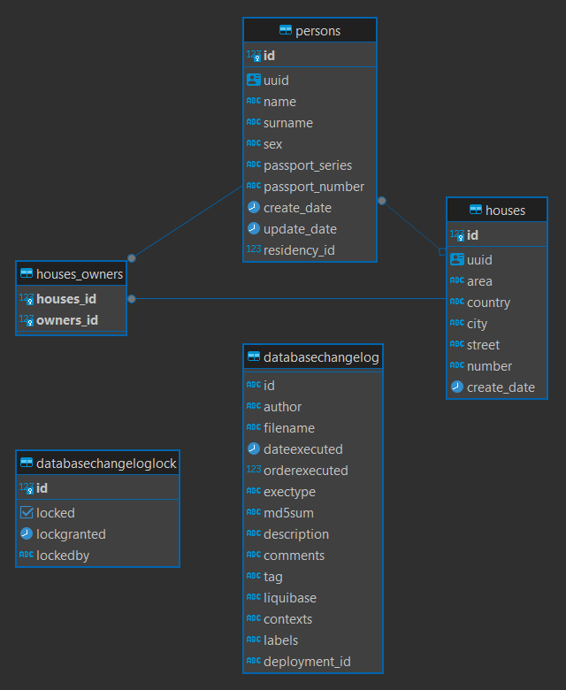
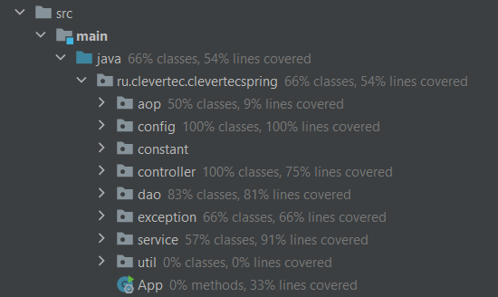

<a name="top-of-page"><h2>CLEVERTEC SPRING</h2></a>

[Параметры приложения, библиотеки и зависимости](#parameters-libraries)

[База данных](#database)

[Кэширование](#cache)

[Логирование](#logging)

[Тесты](#tests)

***

<a name="parameters-libraries"><h2>Параметры приложения, библиотеки и зависимости</h2></a>

- Java 17
- Gradle 8.0
- Spring Boot 3.2.1
- PostgreSQL 15.2
- PostgreSQL JDBC Driver 42.7.1
- Liquibase 4.25.0
- Lombok Plugin 6.5.1
- MapStruct 1.5.5.Final
- SpringDoc OpenAPI 2.3.0
- Testcontainers 1.19.3

Для работы с приложением необходимо использовать Docker, для чего предусмотрен
[docker-compose.yml](docker-compose.yml "docker-compose.yml").
Перед началом работы необходимо выполнить команду `docker compose up`
для создания контейнера базы данных.

Точка входа в приложение - [Main-класс](src/main/java/ru/clevertec/clevertecspring/App.java "App.java").

Для работы с приложением предусмотрен SpringDoc OpenAPI,
для применения требуется перейти в браузере по адресу: http://localhost:8080/swagger-ui/index.html.

Конфигурационные файлы приложения:
- [application.yml](src/main/resources/application.yml "application.yml")
- [application-test.yml](src/test/resources/application-test.yml "application-test.yml")
- [log4j2.properties](src/main/resources/log4j2.properties "log4j2.properties")

[к началу](#top-of-page)

***

<a name="database"><h2>База данных</h2></a>

База данных заполняется автоматически при старте приложения (при помощи Liquibase).

Схема базы данных:

- House может иметь множество жильцов (0 - n)
- House может иметь множество владельцев (0 - n)
- Person обязан жить только в одном доме и не может быть бездомным
- Person не обязан владеть домом, но может владеть множеством домов (0 - n)

см. [Person](src/main/java/ru/clevertec/clevertecspring/dao/entity/Person.java "Person.java"),
[House](src/main/java/ru/clevertec/clevertecspring/dao/entity/House.java "House.java")

[к началу](#top-of-page)

***

<a name="cache"><h2>Кэширование</h2></a>

В приложении реализованы LRU и LFU алгоритмы кэширования данных
(см. [LRUCache](src/main/java/ru/clevertec/clevertecspring/dao/cache/impl/LRUCache.java "LRUCache.java"),
[LFUCache](src/main/java/ru/clevertec/clevertecspring/dao/cache/impl/LFUCache.java "LFUCache.java")).

Алгоритм кэширования можно изменить в конфигурационном файле
[application.yml](src/main/resources/application.yml "application.yml")
(алгоритм по умолчанию - LRU).

Кэширование осуществляется средствами АОП
(см. [PersonRepositoryAspect](src/main/java/ru/clevertec/clevertecspring/aop/PersonRepositoryAspect.java "PersonRepositoryAspect.java"),
[HouseRepositoryAspect](src/main/java/ru/clevertec/clevertecspring/aop/HouseRepositoryAspect.java "HouseRepositoryAspect.java"))
на уровне DAO (репозиторий).

[к началу](#top-of-page)

***

<a name="logging"><h2>Логирование</h2></a>

В приложении реализовано логирование на уровне Service.
Логирование осуществляется средствами АОП
(см. [PersonServiceAspect](src/main/java/ru/clevertec/clevertecspring/aop/PersonServiceAspect.java "PersonServiceAspect.java"),
[HouseServiceAspect](src/main/java/ru/clevertec/clevertecspring/aop/HouseServiceAspect.java "HouseServiceAspect.java")).

Файл, содержащий сформированные логи, `app.log` сохраняется в корневую директорию проекта.

Конфигурационный файл для настройки логирования:
[log4j2.properties](src/main/resources/log4j2.properties "log4j2.properties").

[к началу](#top-of-page)

***

<a name="tests"><h2>Тесты</h2></a>

Покрытие тестами:

Конфигурационный файл для настройки тестов:
[application-test.yml](src/test/resources/application-test.yml "application-test.yml").

[к началу](#top-of-page)

***