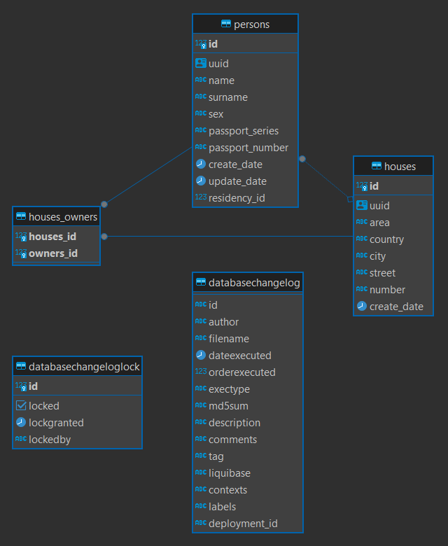

# CLEVERTEC SPRING

***

### Параметры приложения, библиотеки и зависимости

- Java 17
- Gradle 8.0
- Spring Framework 6.1.2, Spring Data JPA 3.2.1
- PostgreSQL 15.2, PostgreSQL JDBC Driver 42.7.1
- Liquibase 4.25.0
- Apache Tomcat 10.1.18
- Hibernate Core 6.4.1.Final, Hibernate Validator 8.0.1.Final
- Jackson 2.16.1
- HikariCP 5.1.0
- Jakarta Annotations 3.0.0-M1, Jakarta Servlet 6.1.0-M1
- Lombok Plugin 6.5.1
- MapStruct 1.5.5.Final
- JUnit 5.9.2

Для работы с приложением необходимо использовать Docker, для чего предусмотрен
[docker-compose.yml](docker-compose.yml "docker-compose.yml").
Перед началом работы необходимо выполнить команду ```docker compose up``` для создания контейнера базы данных.

Точка входа в приложение - main-класс [App](src/main/java/ru/clevertec/clevertecspring/App.java "App.java").

При старте приложения автоматически запускается Apache Tomcat
(см. [TomcatStarter](src/main/java/ru/clevertec/clevertecspring/util/TomcatStarter.java "TomcatStarter.java"))
и заполняется база данных при помощи Liquibase.

***

### Схема базы данных



см. [Person](src/main/java/ru/clevertec/clevertecspring/dao/entity/Person.java "Person.java"),
[House](src/main/java/ru/clevertec/clevertecspring/dao/entity/House.java "House.java")

***

### Примеры HTTP-запросов для работы с приложением

#### - GET (Person Get By UUID)

request url:</br>
http://localhost:8080/persons/6e19a7ae-78f5-475f-92cd-8e838bbc269e

response:

```json
{
  "uuid": "6e19a7ae-78f5-475f-92cd-8e838bbc269e",
  "name": "Ivan",
  "surname": "Ivanov",
  "sex": "MALE",
  "passport": {
    "series": "HB",
    "number": "1111111"
  },
  "residencyUuid": "7d7369f0-368f-4ed3-9fbb-71e7c7664121",
  "createDate": "2024-01-13T17:06:23:195",
  "updateDate": "2024-01-13T17:06:23:195"
}
```

#### - GET (Person Get All)

request url:</br>
http://localhost:8080/persons

response:

```json
[
  {
    "uuid": "6e19a7ae-78f5-475f-92cd-8e838bbc269e",
    "name": "Ivan",
    "surname": "Ivanov",
    "sex": "MALE",
    "passport": {
      "series": "HB",
      "number": "1111111"
    },
    "residencyUuid": "7d7369f0-368f-4ed3-9fbb-71e7c7664121",
    "createDate": "2024-01-13T17:06:23:195",
    "updateDate": "2024-01-13T17:06:23:195"
  },
  {
    "uuid": "36245727-058e-455b-9d42-accc28c05177",
    "name": "Svetlana",
    "surname": "Ivanova",
    "sex": "FEMALE",
    "passport": {
      "series": "HB",
      "number": "1112222"
    },
    "residencyUuid": "7d7369f0-368f-4ed3-9fbb-71e7c7664121",
    "createDate": "2024-01-13T17:06:23:195",
    "updateDate": "2024-01-13T17:06:23:195"
  }
]
```

#### - POST (Person Create)

request url:</br>
http://localhost:8080/persons

request body:

```json
{
  "name": "Sidr",
  "surname": "Sidorov",
  "sex": "MALE",
  "passport": {
    "series": "HB",
    "number": "1173333"
  },
  "residencyUuid": "7d7369f0-368f-4ed3-9fbb-71e7c7664121"
}
```

response:

```json
{
  "uuid": "a1ac59c9-a542-4b02-932f-c97fcae30678",
  "name": "Sidr",
  "surname": "Sidorov",
  "sex": "MALE",
  "passport": {
    "series": "HB",
    "number": "1173333"
  },
  "residencyUuid": "7d7369f0-368f-4ed3-9fbb-71e7c7664121",
  "createDate": "2024-01-13T17:06:23:195",
  "updateDate": "2024-01-13T17:06:23:195"
}
```

#### - PUT (Person Update)

request url:</br>
http://localhost:8080/persons/6e19a7ae-78f5-475f-92cd-8e838bbc269e

request body:

```json
{
  "name": "Ivan",
  "surname": "Ivanov",
  "sex": "MALE",
  "passport": {
    "series": "HB",
    "number": "7755531"
  },
  "residencyUuid": "7d7369f0-368f-4ed3-9fbb-71e7c7664121"
}
```

response:

```json
{
  "uuid": "6e19a7ae-78f5-475f-92cd-8e838bbc269e",
  "name": "Ivan",
  "surname": "Ivanov",
  "sex": "MALE",
  "passport": {
    "series": "HB",
    "number": "7755531"
  },
  "residencyUuid": "7d7369f0-368f-4ed3-9fbb-71e7c7664121",
  "createDate": "2024-01-13T17:06:23:195",
  "updateDate": "2024-01-17T14:17:14:232"
}
```

#### - GET (Get Owners By House UUID)

request url:</br>
http://localhost:8080/persons/owners/1733a4f1-f40c-455f-a108-6d457a6286c7

response:

```json
[
  {
    "uuid": "ab14f5c8-1e57-492c-ac31-cc518f40d59d",
    "name": "Semen",
    "surname": "Semenov",
    "sex": "MALE",
    "passport": {
      "series": "HB",
      "number": "4441112"
    },
    "residencyUuid": "1733a4f1-f40c-455f-a108-6d457a6286c7",
    "createDate": "2024-01-13T17:06:23:195",
    "updateDate": "2024-01-13T17:06:23:195"
  }
]
```

#### - GET (Get Residents By House UUID)

request url:</br>
http://localhost:8080/persons/owners/1733a4f1-f40c-455f-a108-6d457a6286c7

response:

```json
[
  {
    "uuid": "ab14f5c8-1e57-492c-ac31-cc518f40d59d",
    "name": "Semen",
    "surname": "Semenov",
    "sex": "MALE",
    "passport": {
      "series": "HB",
      "number": "4441112"
    },
    "residencyUuid": "1733a4f1-f40c-455f-a108-6d457a6286c7",
    "createDate": "2024-01-13T17:06:23:195",
    "updateDate": "2024-01-13T17:06:23:195"
  },
  {
    "uuid": "c2994a09-1211-49d2-858f-9d79744fb2f3",
    "name": "Julia",
    "surname": "Semenova",
    "sex": "FEMALE",
    "passport": {
      "series": "HB",
      "number": "5511771"
    },
    "residencyUuid": "1733a4f1-f40c-455f-a108-6d457a6286c7",
    "createDate": "2024-01-13T17:06:23:195",
    "updateDate": "2024-01-13T17:06:23:195"
  }
]
```

#### - GET (House Full Text Search)

request url:</br>
http://localhost:8080/houses/fulltextsearch/A

response:

```json
[
  {
    "uuid": "7d7369f0-368f-4ed3-9fbb-71e7c7664121",
    "area": "Eurasia",
    "country": "Belarus",
    "city": "Gomel",
    "street": "Bazarnaya",
    "number": "1-A",
    "createDate": "2024-01-13T17:06:23:195"
  },
  {
    "uuid": "fc34b864-9b6f-43f3-8f38-2707b34e3c7b",
    "area": "Eurasia",
    "country": "Belarus",
    "city": "Gomel",
    "street": "Bazarnaya",
    "number": "2-A",
    "createDate": "2024-01-13T17:06:23:195"
  }
]
```

***