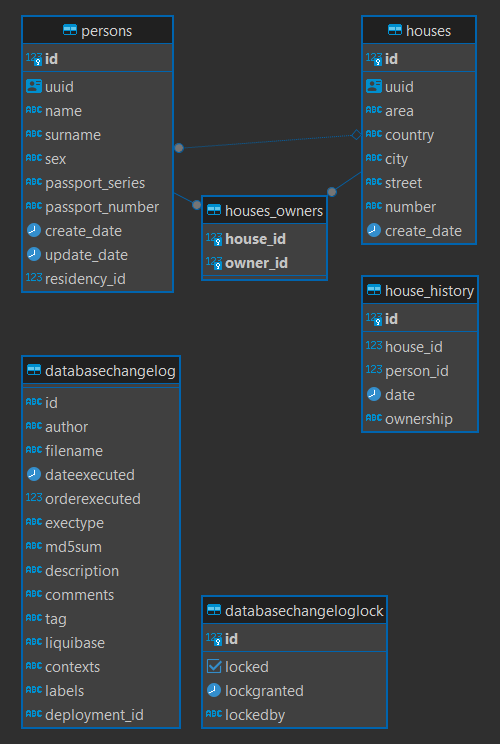

# CLEVERTEC SPRING

***

### Параметры приложения, библиотеки и зависимости

- Java 17
- Gradle 8.0
- Spring Boot 3.2.1
- PostgreSQL 15.2
- PostgreSQL JDBC Driver 42.7.1
- Liquibase 4.25.0
- MapStruct 1.5.5.Final
- SpringDoc OpenAPI 2.3.0
- Testcontainers 1.19.3

Для работы с приложением необходимо использовать Docker, для чего предусмотрен
[docker-compose.yml](docker-compose.yml "docker-compose.yml").
Перед началом работы необходимо выполнить команду ```docker compose up```
для создания контейнера базы данных.

Точка входа в приложение - [Main-класс](app/src/main/java/ru/clevertec/clevertecspring/App.java "App.java").

Для работы с приложением предусмотрен SpringDoc OpenAPI,
для применения требуется перейти в браузере по адресу: http://localhost:8080/swagger-ui/index.html.

***

### База данных

База данных заполняется автоматически при старте приложения (при помощи Liquibase).

Схема базы данных:



- House может иметь множество жильцов (0 - n)
- House может иметь множество владельцев (0 - n)
- Person обязан жить только в одном доме и не может быть бездомным
- Person не обязан владеть домом, но может владеть множеством домов (0 - n)

см. [Person](dao/src/main/java/ru/clevertec/clevertecspring/entity/Person.java "Person.java"),
[House](dao/src/main/java/ru/clevertec/clevertecspring/entity/House.java "House.java")

***